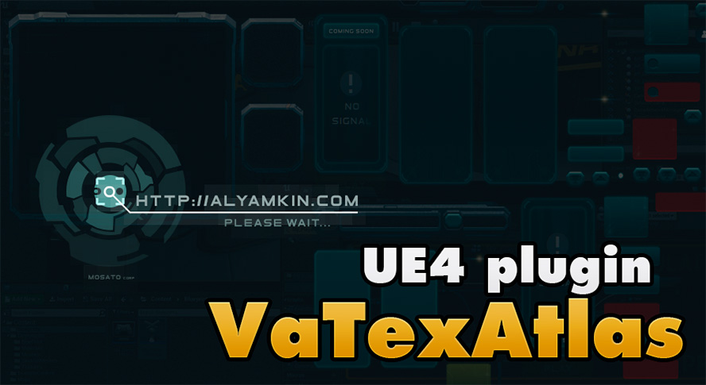

VaTexAtlas
==========

Welcome to the VaTexAtlas source code! VTA is the plugin for [Unreal Engine 4](https://www.unrealengine.com/) that makes texture atlases simpler to use with UMG system.

Key features:

* 
*
*

Check the [Wiki](https://dragon.atlassian.net/wiki/display/VTA/) for plugin usage examples and installation notes.

Current version: **1.0 RC 1** (UE 4.10-12)

Legal info
----------

Unreal® is a trademark or registered trademark of Epic Games, Inc. in the United States of America and elsewhere.

Unreal® Engine, Copyright 1998 – 2016, Epic Games, Inc. All rights reserved.
